# Use-case flow diagrams

Companion to [`CANONICAL.md`](CANONICAL.md). Each UC links here under **How it works**.

---

## Auth identity {#auth-identity}

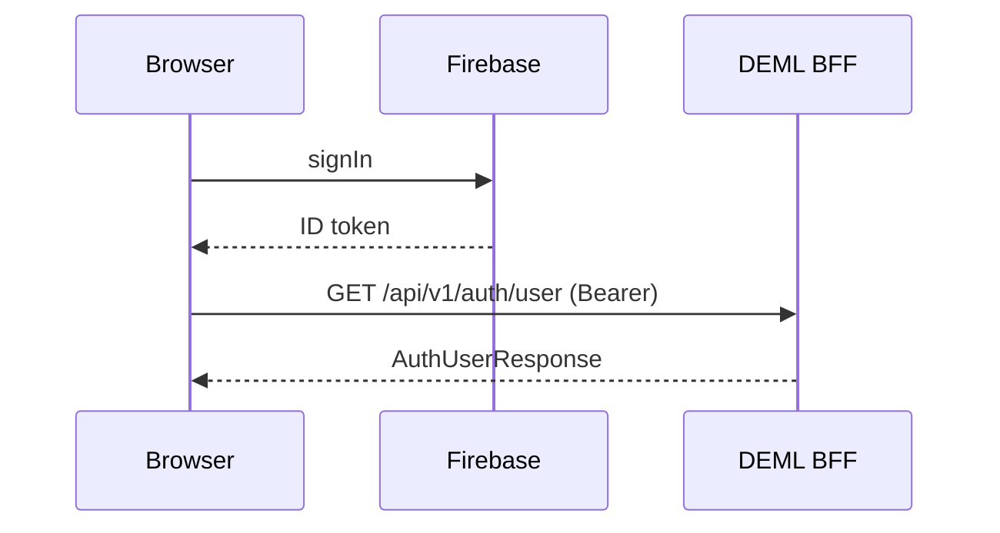

Used by: UC-AUTH-001, UC-AUTH-004, UC-AUTH-005.

---

## Browser sessions & handoff {#auth-sessions}

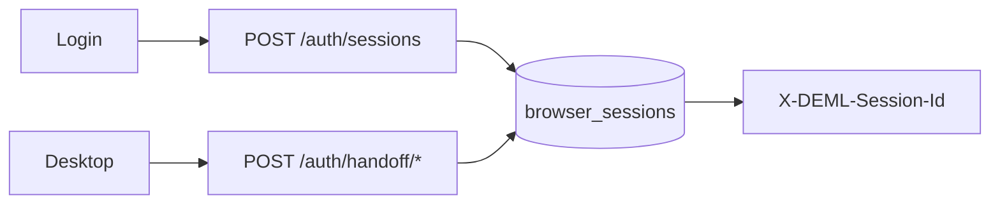

Used by: UC-AUTH-002, UC-AUTH-003.

---

## Account deletion saga {#auth-delete}

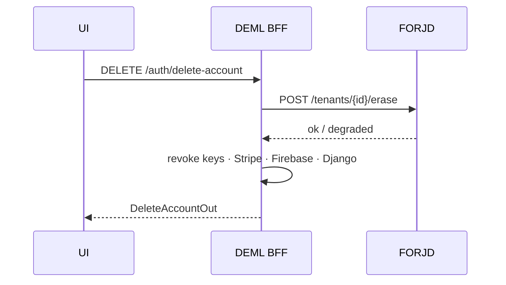

Used by: UC-AUTH-006.

---

## Billing entitlement {#billing}

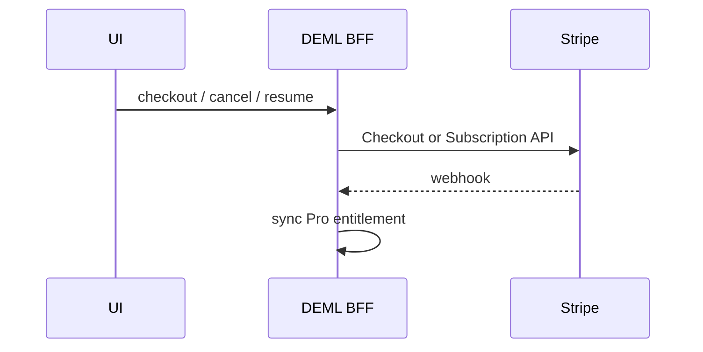

Used by: UC-BILL-001 … UC-BILL-003.

---

## Consent & newsletter {#consent}

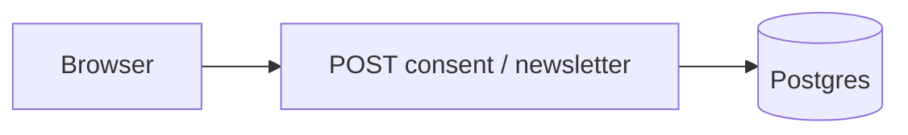

Used by: UC-CONSENT-001, UC-CONSENT-002.

---

## Dashboard & analytics (control → data plane) {#analytics}

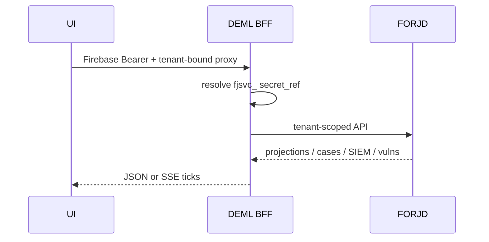

Used by: UC-DASH-001, UC-ANALYTICS-*, UC-SIEM-001, UC-VULN-001, UC-PROJ-001, UC-EXPORT-001, UC-ML-001, UC-COMPLY-001, UC-REPORT-001.

---

## Sealed ingest {#ingest}

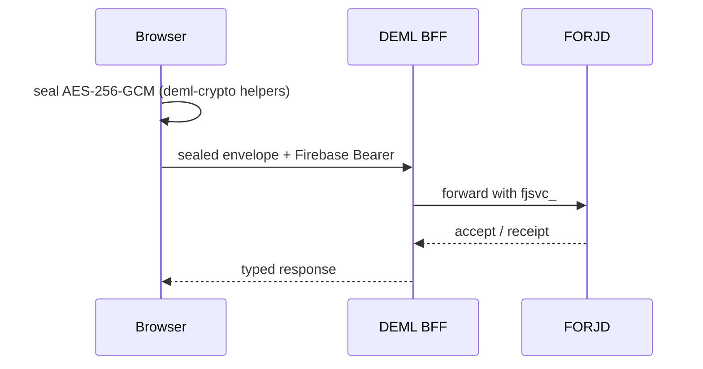

Used by: UC-INGEST-001 … UC-INGEST-003, UC-WIDGET-001.

---

## Pipeline Studio {#pipeline}

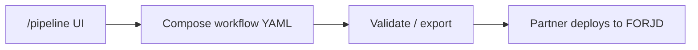

Used by: UC-PIPE-001. DEML does not write partner workflows via API.

---

## Status pages {#status}

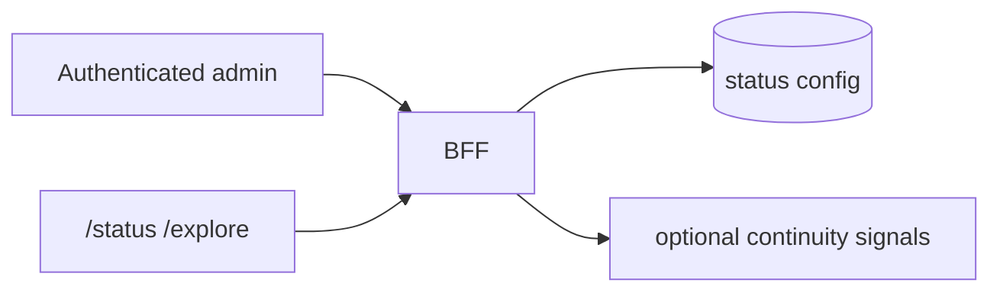

Used by: UC-STATUS-001, UC-STATUS-002.

---

## Integrations & webhooks {#integrations}

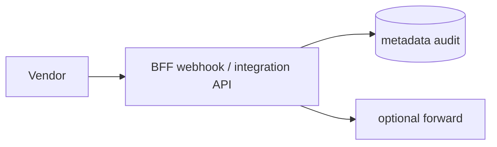

Used by: UC-INTEG-001, UC-INTEG-002.

---

## Health & CORS {#ops}

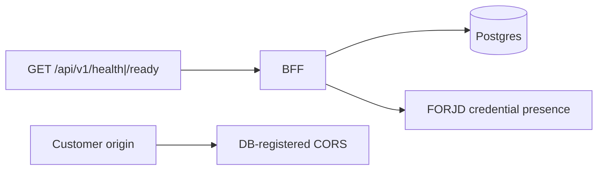

Used by: UC-HEALTH-001, UC-CORS-001.

---

## Settings / account / onboarding {#settings}

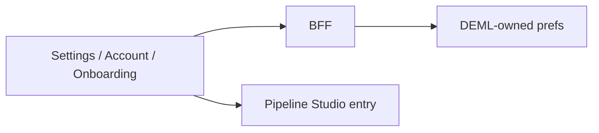

Used by: UC-SETTINGS-001, UC-ACCOUNT-001, UC-ONBOARD-001.

---

## Learning (deferred) {#learning}

Learning progress remains deferred — see [`DEAD_CODE.md`](DEAD_CODE.md) and UC-LEARN-001.
Anti-regression tests must keep plaintext learning ingest rejected.
